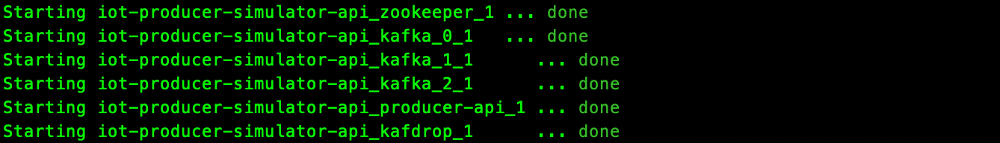

# Producer Simulator API

Project to simulate IoT sensor sending events to a Kafka cluster.

## Technologies

- **[Spring Webflux](https://docs.spring.io/spring/docs/current/spring-framework-reference/web-reactive.html)** - 2.5.5
- **[Mapstruct](https://mapstruct.org/)** - 1.4.2.Final
- **[Immutables](https://immutables.github.io/)** - 2.8.8
- **[Gradle](https://gradle.org/)** - 7.2
- Java 11
- Kafka

## Getting Started

### Requirements

- Docker
  - Needed in case you want to run Kafka with Docker. In case you want to use the Kafka scripts, you don't need it.
- Java 11
  - Need have the JAVA_HOME set in case you want to execute via Gradle

### Building

At the project root folder, execute:

```shell
gradlew build
```

#### Only tests

At the project root folder, execute:

```shell
gradlew test
```

#### Jacoco

```shell
gradlew test jacocoTestReport
```

Path: `./build/reports/jacoco/jacocoRootReport/html/index.html`

### Running

   1. Install docker: https://docs.docker.com/engine/install/ 

      - On Linux, docker compose need be installed separately: https://docs.docker.com/compose/install/
      
   2. Run the docker compose file

      ````bash
      docker-compose -f "docker-compose.yml" up --build -d
      ````

      

      It will start:

      - 1x [Zookeper](https://hub.docker.com/r/wurstmeister/zookeeper)
      - 3x [Kafka](https://hub.docker.com/r/wurstmeister/kafka) brokers
      - [Kafdrop](https://hub.docker.com/r/obsidiandynamics/kafdrop)
      - Producer API

   3. The IOT Producer starts on `localhost:8080` with docker and `localhost:8080` using the default profile.

      1. Checkout the [OpenApi](docs/api/openapi.yml) to know about the endpoint and how execute them.
      
      :memo: It also comes with [Kafdrop](https://github.com/obsidiandynamics/kafdrop), which is *is a web UI for viewing Kafka topics and browsing consumer groups*. You can access via browser: [http://localhost:9000](http://localhost:9000/).

## Documentation

### OpenApi

The endpoints are documented using OpenApi and can be found at [docs/api/openapi.yml](docs/api/openapi.yml)

More about OpenAPI: https://www.openapis.org/.

### Flows

To generate the sensor events we have two flows: via single sensor or via sensor cluster.

#### Single sensor

The `Single sensor` endpoint provides the capability to set up a single sensor (with all the information provided by you) and then send as many request you want. 

For example, let's say we have the sensor `Living Room Temp` and we want to simulate the events for `TEMPERATURE` every `5 seconds`  for `10 minutes`. This is what the request would look like:

````curlrc
curl --location --request POST 'http://localhost:8080/producer-api/events' \
--header 'Content-Type: application/json' \
--data-raw '[
    {
        "total": 120,
        "type": "TEMPERATURE",
        "heartBeat": 5,
        "id": 1,
        "name": "Living Room Temp",
        "clusterId": "1"
    }
]'
````

:memo: The `id` is a unique identifier of this sensor and is mandatory.

:memo: The `clusterId`, identifies this sensor as belonging to a cluster. Later you can query all the sensor in the same cluster. This field is optional.

:memo: The `total` is how many events do you want. In our example, we wanted it running for 10 minutes, so: 120 X 5 seconds = 10 minutes

:memo: The `heartBeat` is the interval, in seconds, between each event.

You can also send more than one sensor at the time:

````curlrc
curl --location --request POST 'http://localhost:8080/producer-api/events' \
--header 'Content-Type: application/json' \
--data-raw '[
    {
        "total": 120,
        "type": "TEMPERATURE",
        "heartBeat": 5,
        "id": 1,
        "name": "Living Room Temp",
        "clusterId": "1"
    },
    {
        "total": 10,
        "type": "HUMIDITY",
        "heartBeat": 10,
        "id": 2,
        "name": "Living Room Humidity",
        "clusterId": "1"
    }
]'
````

For more info about the endpoint, see [openapi.yml](docs/api/openapi.yml)

####  Sensor cluster

In the sensor cluster, it will simulate a several sensors sending events at the same time. 

Taking the same example as before, lets say now we added 100 more sensors for temperature, and we still want to simulate the same: events for `TEMPERATURE` every `5 seconds`  for `10 minutes`. 

The request would look like:

````curlrc
curl --location --request POST 'http://localhost:8080/producer-api/clusters' \
--header 'Content-Type: application/json' \
--data-raw '[
    {
        "total": 120,
        "type": "TEMPERATURE",
        "heartBeat": 5,
        "clusterSize": 100,
        "clusterId": 1
    }
]'
````

:memo: `clusterSize` is how many sensor you want running in parallel.

:memo: Note that now we don't provide the `id`, it's because the server is going to random generate one for each sensor. In this case is easier to query the sensor events by `clusterId`.

Here we can also send more than one type:

````curlrc
curl --location --request POST 'http://localhost:8080/producer-api/clusters' \
--header 'Content-Type: application/json' \
--data-raw '[
    {
        "total": 200,
        "type": "HUMIDITY",
        "heartBeat": 3,
        "clusterSize": 10,
        "clusterId": 1
    },
    {
        "total": 120,
        "type": "TEMPERATURE",
        "heartBeat": 5,
        "clusterSize": 100,
        "clusterId": 1
    }
]'
````

For more info about the endpoint, see [openapi.yml](docs/api/openapi.yml)

### Kafka

To distribute the sensor data we are using Kafka streams. When using the `docker-compose.yml`, it starts 3 kafka brokers:

- `kafka_0`
- `kafka_1`
- `kafka_2`

> In case connecting from outside docker network use `localhost` + the instance port: `9092`, `9094` and `9095` to connect


> In case connecting within docker network use instance name + port: `kafka_0:29092`,`kafka_1:29093` and `kafka_2:29094`. More info: [Kafka Listeners - Explained](https://rmoff.net/2018/08/02/kafka-listeners-explained/) 

All the sensor events are forward to the Kafka topic `iot-data` and they have the following structure:

| Field     | Type           | Description                          | Mandatory |
|-----------|----------------|--------------------------------------|-----------|
| id        | Long           | Sensor ID                            | Y         |
| value     | BigDecimal     | Sensor measured value                | Y         |
| timestamp | OffsetDateTime | Event timestamp                      | Y         |
| type      | String         | Sensor type                          | Y         |
| name      | String         | Sensor name                          | Y         |
| clusterId | Long           | Cluster of which this sensor belongs | N         |
